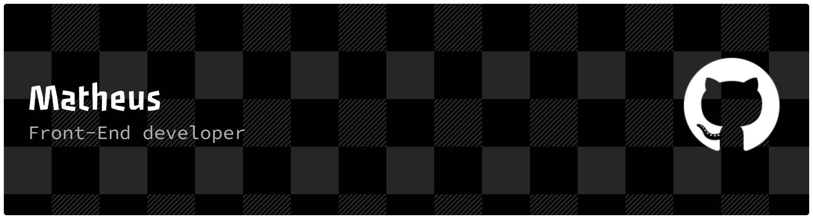

# Olá, eu sou o Matheus Pompei! 👋
**`Software Developer | UI/UX Designer`**

Sou estudante de **Análise e Desenvolvimento de Sistemas** , unindo a lógica de programação à criatividade do design. Meu foco é entregar sistemas completos, funcionais e visualmente impactantes. 

Atualmente, transformo ideias em realidade digital, cuidando desde o **prototipagem no Figma** até o **deploy final** em tecnologias modernas como React e React Native.

---

### 🛠️ Minha Stack

| **Área** | **Tecnologias** |
|:------------------|:----------------|
| **Design / UI/UX**|  |
| **Front-end** |  |
| **Back-end/DB** |  |
| **Ferramentas** |  |

---

### 📫 Vamos nos conectar?

  
  <a href="https://opompeii.github.io/curriculo/" target="_blank">
        

